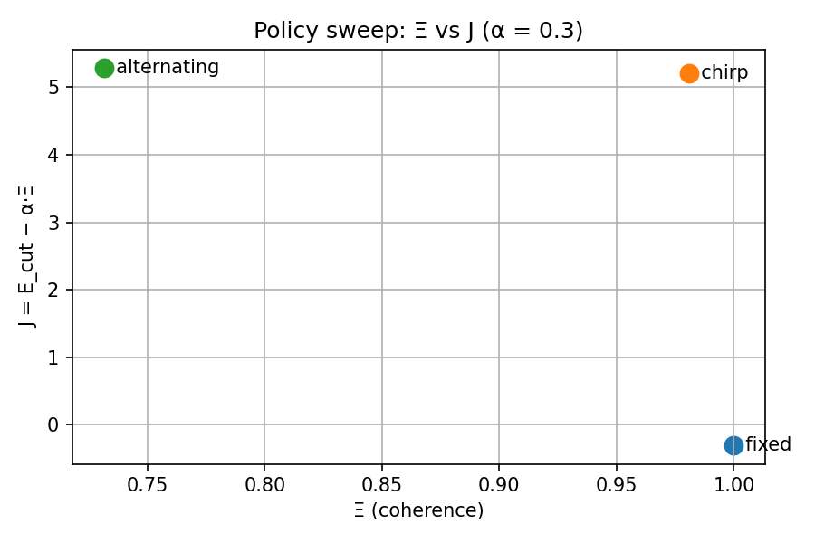

# WaveCore-NL Tile

[](https://github.com/QCT-xyz/wavecore-nl-tile/actions/workflows/ci.yml)

Photonic schedule synthesis with a coherence knob Ξ. Outputs ONNX-reproducible control bundles.

## Quickstart
```bash
python -m venv .venv && source .venv/bin/activate
pip install -e ".[dev]"
cp .env.example .env
python -m wavecore_nl.cli show-config
python examples/quickstart.py

Minimal API

from wavecore_nl.tile import Tile
tile = Tile(modes=16)
# provide an Ising J or QAOA-derived coupling

Project status
	•	CI: lint, type check, tests
	•	ONNX: controller stub export
	•	Ξ: simple phasor-based proxy

Next steps
	•	Add Ξ-weighted objective J = E_cut − α Ξ
	•	Add schedule policies: fixed, chirp, alternating
	•	Benchmark on small Max-Cut sets

## Visualization

